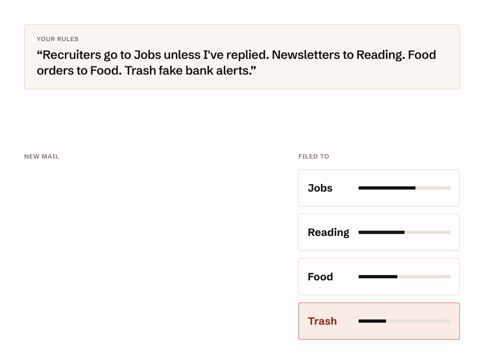

# MailRules

MailRules is a small daemon that sorts incoming email over IMAP, in real time, using rules you write in plain English or as structured conditions. It works with any IMAP provider (iCloud, Fastmail, Yahoo, Zoho, your own server), lets you choose the model that decides, and runs as one binary with the web UI built in.

[](https://mailrules.app/?utm_source=github&utm_medium=readme&utm_content=demo)

Website and hosted version: [mailrules.app](https://mailrules.app/?utm_source=github&utm_medium=readme&utm_content=intro)

It starts safe: it listens on this machine only, and dry-run is on, so it records what it would do and changes no mailbox until you switch dry-run off.

Releases are on the [GitHub Releases page](https://github.com/TurtleByte-IN/mailrules/releases): binaries for Linux and macOS (amd64 and arm64), a Docker image at `ghcr.io/turtlebyte-in/mailrules`, and a Homebrew cask.

## Documentation

The [user guide](docs/guide/README.md) covers everything below in detail:

- [Install](docs/guide/install.md), including Compose, systemd and upgrading
- [First run](docs/guide/first-run.md)
- [Rules](docs/guide/rules.md)
- [Dry-run and going live](docs/guide/dry-run.md)
- [Decision models and keys](docs/guide/models.md)
- [Undo and activity](docs/guide/undo-and-activity.md)
- [Summary email](docs/guide/summary-email.md)
- [Backup and the master key](docs/guide/backup.md)
- [Security](docs/guide/security.md)
- [Troubleshooting](docs/guide/troubleshooting.md)
- [Settings reference](docs/guide/settings.md)

## Quickstart with Docker

```bash
docker run -d --name mailrules --restart unless-stopped \
  --read-only --tmpfs /tmp -p 127.0.0.1:8080:8080 \
  -e MAILRULES_COOKIE_SECURE=false -v mailrules-data:/data \
  ghcr.io/turtlebyte-in/mailrules:latest
```

Open <http://127.0.0.1:8080> on the same machine. To use Docker Compose instead, see [Install](docs/guide/install.md#docker-compose).

## Quickstart with Homebrew

On macOS, and on Linux with Homebrew:

```bash
brew install --cask turtlebyte-in/tap/mailrules
mailrules serve
```

The cask comes from the tap [`TurtleByte-IN/homebrew-tap`](https://github.com/TurtleByte-IN/homebrew-tap). The data directory is `./data` in the directory you start it from, unless you set `MAILRULES_DATA_DIR`.

## Quickstart with a single binary

Download the archive for your system and `checksums.txt` from the [Releases page](https://github.com/TurtleByte-IN/mailrules/releases), check it and unpack it:

```bash
sha256sum --ignore-missing -c checksums.txt   # on macOS: shasum -a 256 --ignore-missing -c checksums.txt
tar xzf mailrules_<version>_linux_amd64.tar.gz
./mailrules serve
```

The macOS binaries are not signed; see [Install](docs/guide/install.md#single-binary) if macOS refuses to open one. To build from source, or to run MailRules as a systemd service, see [Install](docs/guide/install.md#build-from-source).

## First steps

1. Open <http://127.0.0.1:8080> and create the admin account.
2. Choose the decision model and give it a key, or skip that: rules made only of conditions need no model.
3. Connect a mailbox with an app password, and pick a few starter rules.
4. Watch **Activity** while dry-run is on, then switch dry-run off.

[First run](docs/guide/first-run.md) walks through each step.

## Developing

- `make check`: gofmt, go vet, golangci-lint, `go test -race ./...` with a coverage floor of 80% in `internal/rules`, `internal/pipeline` and `internal/actions`, the settings reference check and the web app's checks
- `make dev`: the daemon, plus the Vite dev server when `web/` exists
- `make build`: builds the web app when `web/` exists, then the single binary
- `make settings-doc`: regenerates [`docs/guide/settings.md`](docs/guide/settings.md) from `internal/config`; edit the help text there, not the page

The HTTP API is described in [`docs/api.md`](docs/api.md) and the pre-release checklist is [`docs/smoke.md`](docs/smoke.md).

Suggest from my mail, which has the AI suggest rules from the mail already in a folder, is not part of this repository: the hosted MailRules adds it as a module. The free build answers its API route with 404 `not_available` and does not show its tab. A build adds modules through the public Go package `ext` (`ext/daemon.Run` starts the daemon with them); `cmd/mailrules` is this repository's build, with none.

## Releases

Pushing a tag such as `v0.1.4` runs `.github/workflows/release.yml`. It runs `make check`; GoReleaser (`.goreleaser.yaml`) then builds the web app and the binaries and publishes the GitHub Release with the archives and `checksums.txt`, not yet marked latest; and the multi-arch image is built from `deploy/Dockerfile` and pushed to `ghcr.io/turtlebyte-in/mailrules` with its version tag only. Next, `.github/workflows/verify-release.yml` installs every published format the way users do and runs it with `scripts/release-smoke.sh`: each archive on Linux amd64 and arm64 and macOS arm64 and Intel, the image on amd64 and arm64, and the Homebrew cask on macOS and Linux. Only when all of them pass does the release become the latest, the image get `latest`, and the cask go to the tap `TurtleByte-IN/homebrew-tap` (which needs the `HOMEBREW_TAP_TOKEN` secret; without it the cask is not published). A failed check leaves users on the previous release. The verify workflow can also be run by hand against any tag (Actions → verify-release → Run workflow). GitHub creates the image package as private the first time; make it public once in its package settings. To try the release build without publishing anything: `goreleaser release --snapshot --clean --skip=publish`.

## Security

Report vulnerabilities privately with [Report a vulnerability](https://github.com/TurtleByte-IN/mailrules/security/advisories/new) on the repository's Security tab, not in a public issue. See [Security](docs/guide/security.md) for the defaults and for running MailRules behind a reverse proxy.

## License

Copyright (C) 2026 TurtleByte.

MailRules is free software: you can redistribute it and/or modify it under the terms of the GNU Affero General Public License, version 3 only, as published by the Free Software Foundation. It is distributed in the hope that it will be useful, but without any warranty; without even the implied warranty of merchantability or fitness for a particular purpose. See [`LICENSE`](LICENSE) for the full text.

If you run a modified MailRules where other people use it over a network, the licence requires you to offer them your modified source. The web UI links to the source from the sidebar ("Source code"); point that link at your own copy.

The web UI bundles the Schibsted Grotesk and IBM Plex Mono fonts, which are licensed under the SIL Open Font License 1.1. Every Go dependency, and every npm package shipped in the web UI, is under MIT, BSD, ISC or Apache 2.0.
